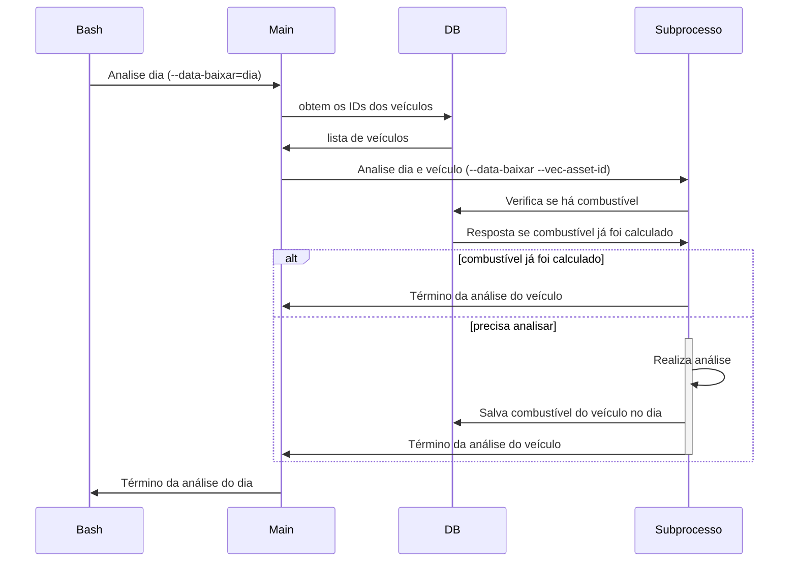
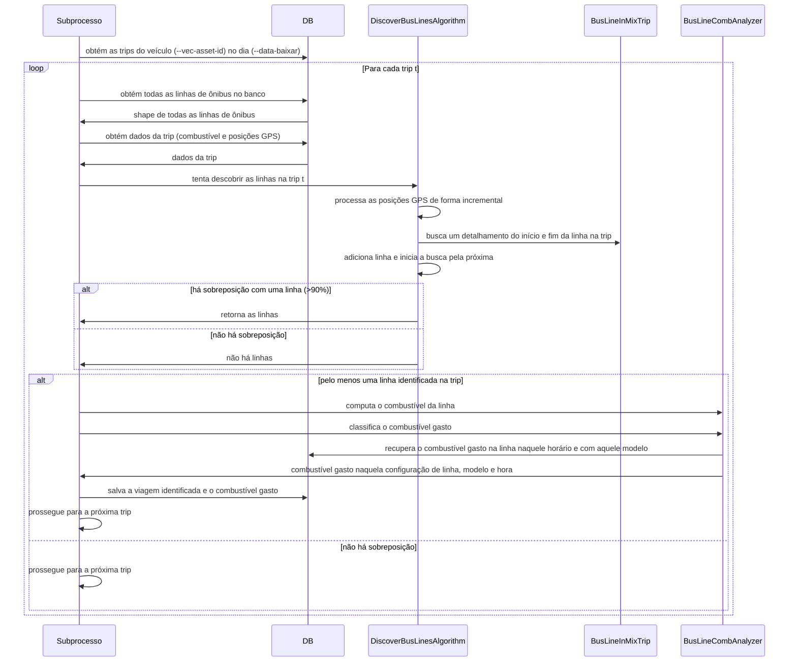

# Analisa Combustível RMTC

Esta pasta contém um programa Python que calcula o combustível gasto por um determinado veículo em uma rota através dos dados da RMTC (itinerário), Mix (combustível) e da Rápido Araguaia (shape das rotas).

O sufixo RMTC indica que a fonte primária para a posição dos veículos origina-se do site da RMTC (Olho no Trânsito). Em contraste, existe o projeto Análise de Combustível Mix que utiliza as posições GPS dos veículos da Mix. Uma desvantagem deste projeto frente ao da Mix é que caso o script que capture os dados da RMTC falhe ou haja alterações substanciais, o script não conseguirá calcular o combustível do veículo. 

Por conta da complexidade, o projeto está divido em um script principal (main) e _workers_ que fazem a análise para um determinado veículo 

# Arquivos

O programa contém os seguintes arquivos:
| Arquivo                             | Função                                                                                       | Parâmetros                                                                                             |
| ----------------------------------- | -------------------------------------------------------------------------------------------- | ------------------------------------------------------------------------------------------------------ |
| `analise_combustivel_main.py`       | Script que coordena a análise                                                                | `--data-baixar=YYYY-MM-DD` data na qual será feita a análise                                           |
| `analise_combustivel_subprocess.py` | Subprocesso que realiza de fato a análise                                                    | `--data-baixar=YYYY-MM-DD` data na qual será feita a análise e `--vec_asset_id=ASSET_ID` id do veículo |
| `analise_job.sh`                    | Bash script para facilitar a execução do script para múltiplo dias e sua implantação no CRON | Nenhum                                                                                                  |
| `bus_line_comb_analyzer.py`         | Classe que gerencia a análise da linha de ônibus                                             | Nenhum (classe Interna)                                                                                |
| `bus_line_trip.py`                  | Classe que representa uma viagem do ônibus da RA dentro de uma trip da Mix                   | Nenhum (classe Interna)                                                                                |
| `db.py`                             | Singleton para controlar o acesso ao banco de dados PostgreSQL                               | Nenhum (classe Interna)                                                                                |
| `discover_bus_line.py`              | Classe que fornecer funções para descobrir uma linha de Ônibus com base nos dados da Mix     | Nenhum (classe Interna)                                                                                |
| `cron.txt`                          | Exemplo para inserção do script no cron                                                      | Nenhum                                                                                                 |
| `Dockerfile`                        | Arquivo para construção da Imagem do Docker                                                  | Nenhum                                                                                                 |
| `README.md`                         | Este arquivo de instrução                                                                    | Nenhum                                                                                                 |
| `requirements.txt`                  | Arquivo com as dependências Python do projeto                                                | Nenhum                                                                                                 |

# Variáveis de ambiente

Além dos scripts, o programa espera receber um arquivo .env com as variáveis ambientes estruturadas conforme .env.sample. As variáveis são:

| Variável | Função                                | Exemplo    |
| -------- | ------------------------------------- | ---------- |
| DB_HOST  | Endereço do banco de dados PostgreSQL | 127,0.0.1  |
| DB_PORT  | Porta do banco de dados PostgreSQL    | 5432       |
| DB_USER  | Usuário do banco de dados PostgreSQL  | admin      |
| DB_PASS  | Senha do banco de dados PostgreSQL    | senha      |
| DB_NAME  | Nome do banco de dados PostreSQL      | nome_banco |

# Execução

O script pode ser executado diretamente no seu ambiente ou via um container (como Docker)

## Execução local

1. Copie o arquivo de variáveis de ambiente
`cp .env.sample .env`
Edite as variáveis conforme a sua configuração.

2. Crie o ambiente virtual
Você pode criar utilizando o virtualenv ou anaconda, no exemplo abaixo utilizaremos o anaconda.
´conda create -y -n analise-combustivel python=3.11`

3. Ative o ambiente
`conda activate analise-combustivel`

4. Instale as dependências 
`pip install -r requirements.txt`

5. Executar o script principal (um dia específico)
`python scripts_python/analise_combustivel_rmtc/analise_combustivel_main.py 
  --data_baixar=2025-02-01`

6. Execute em lote
`bash scripts_python/analise_combustivel_rmtc/analise_job.sh`

## Execução via Container

1. Na pasta scripts-ra, copie o arquivo de variáveis de ambiente
`cp .env.sample .env`
Edite as variáveis de ambiente conforme a sua configuração

2. Faça o build via docker
`docker compose build analise_combustivel_mix`

3. Execute
`docker compose up analise_combustivel_mix`

# Fluxo de Execução

O fluxo de execução pode ser dividido em duas partes, a parte referente ao controle da análise (scripts e main) e o cálculo em si (subprocesso). 
Para facilitar a compreensão, o diagrama abaixo ilustra a execução do controle principal da análise. Para cada dia definido pelo script `analise_job.bash`, inicia-se o programa `analise_combustivel_main.py`, que por sua vez inicia um subprocesso por veículo.

A execução do subprocesso é responsável por realizar a análise de combustível de um veículo (`--vec-asset-id`) em um determinado dia (`--data-baixar`).
Primeiro, o subprocesso recupera todas as trips realizada pelo veículo naquele dia.
Para cada trip `t`, o subprocesso tenta recuperar as viagens em linhas realizada na trip.
- Obtém todas as linhas do banco de dados
- Instancia a classe `DiscoverBusLinesAlgorithm`
- Obtém o combustível gasto na trip `t`
- Obtém as posições do veículo na trip `t`
- Executa o algoritmo de busca de linhas
  
O algoritmo de busca de linhas funciona da seguinte forma:
- Processa de forma incremental cada posição `init_search_idx` de `0` até `N` do veículo na trip `t` (`df_gps_sort`).
- Seja `curr_idx` a posição corrente sendo processada, onde `init_search_idx` <= `curr_idx` <= `N`
- Recupera o vetor de posição do veículo `df_gps_filtro_raw` de `init_search_idx` até `curr_idx`, 
  
  ``df_gps_filtro_raw = df_gps_sort.iloc[init_search_idx : curr_idx + 1]``

- Bufferiza as posições `buf_raw` a partir de `df_gps_filtro_raw`, para compensar o fato das posições GPS serem discretas
- Calcula a sobreposição da trajetória `buf_raw` com todas as linhas
- Caso a sobreposição seja >= a um limiar (90%), considera-se que a linha foi encontrada
- Instancia a classe `BusLineInMixTrip` para obter mais informações da linha
- Limpa a linha e acha o ponto inicial (sem repetição)
  - Isso é necessário pois o veículo pode ter ficado parado gerando posições repetidas (ex: no terminal)
  - Usamos o ponto inicial para descobrir a hora que o veículo saiu e para cálculos de combustível
- Descobre o sentido da linha comparando o ponto inicial
- Faz o caminho inverso e encontra a linha até o seu ponto final, incrementa `curr_idx` até achar um ponto que tenha sobreposição com o ponto final da linha
  - Caso não encontre, desconsidere os pontos adicionados para não afetar a análise de combustível
- Retorna a linha identificada e a % do km sobreposto a partir dos pontos iniciais e finais identificados
- Reinicia a busca para a próxima linha utilizando o ponto final da atual como inicio da busca `init_search_idx` até percorrer todas as posições do veículo na trip

