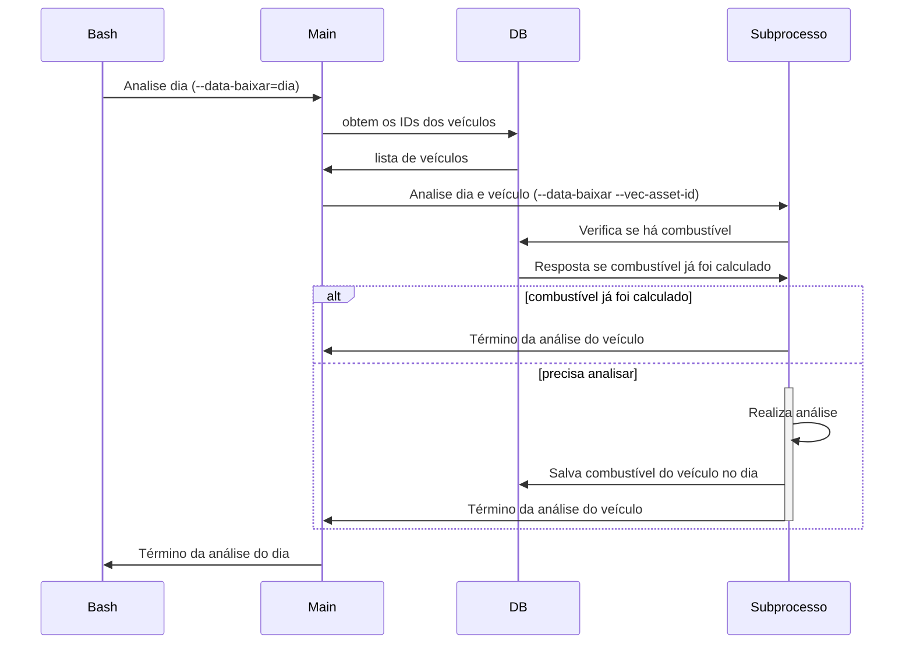

# Analisa Combustível RMTC

Esta pasta contém um programa Python que calcula o combustível gasto por um determinado veículo em uma rota através dos dados da RMTC (itinerário), Mix (combustível) e da Rápido Araguaia (shape das rotas).

O sufixo RMTC indica que a fonte primária para a posição dos veículos origina-se do site da RMTC (Olho no Trânsito). Em contraste, existe o projeto Análise de Combustível Mix que utiliza as posições GPS dos veículos da Mix. Uma desvantagem deste projeto frente ao da Mix é que caso o script que capture os dados da RMTC falhe ou haja alterações substanciais, o script não conseguirá calcular o combustível do veículo. 

Por conta da complexidade, o projeto está divido em um script principal (main) e _workers_ que fazem a análise para um determinado veículo 

# Arquivos

O programa contém os seguintes arquivos:
|Arquivo|Função|Parâmetros|
|--|--|--|
|`analise_combustivel_main.py`|Script que coordena a análise|`--data-baixar=YYYY-MM-DD` data na qual será feita a análise|
|`analise_combustivel_subprocess.py`|Subprocesso que realiza de fato a análise|`--data-baixar=YYYY-MM-DD` data na qual será feita a análise e `--vec_asset_id=ASSET_ID` id do veículo|
|`analise_job.sh`| Bash script para facilitar a execução do script para múltiplo dias e sua implantação no CRON | Nenum|
|`Dockerfile`|Imagem do Docker|Nenhum|
|`docker-compose.yml`|Arquivo de Instrução do Docker|Nenhum|
|`environment.yml`| Arquivo YML com as dependência do Conda|Nenhum|
|`env.sample`| Arquivo com as variáveis ambientes utilizadas, detalhadas a seguir|Nenhum|
|`README.md`| Este arquivo de instrução|Nenhum|
|`requirements.txt`| Arquivo com as dependências Python do projeto|Nenhum|

# Variáveis de ambiente

Além dos scripts, o programa espera receber um arquivo .env com as variáveis ambientes estruturadas conforme .env.sample. As variáveis são:

|Variável|Função|Exemplo|
|--|--|--|
|DB_HOST|Endereço do banco de dados PostgreSQL|127,0.0.1|
|DB_PORT|Porta do banco de dados PostgreSQL|5432|
|DB_USER|Usuário do banco de dados PostgreSQL|admin|
|DB_PASS|Senha do banco de dados PostgreSQL|senha|
|DB_NAME|Nome do banco de dados PostreSQL|nome_banco|

# Execução

O script pode ser executado diretamente no seu ambiente ou via um container (como Docker)

## Execução local

1. Copie o arquivo de variáveis de ambiente
`cp .env.sample .env`
Edite as variáveis conforme a sua configuração.

2. Crie o ambiente virtual
Você pode criar utilizando o virtualenv ou anaconda, no exemplo abaixo utilizaremos o anaconda.
´conda create -y -n analise-combustivel python=3.11`

3. Ative o ambiente
`conda activate analise-combustivel`

4. Instale as dependências 
`pip install -r requirements.txt`

5. Executar o script principal (um dia específico)
`python scripts_python/analise_combustivel_rmtc/analise_combustivel_main.py 
  --data_baixar=2025-02-01`

6. Execute em lote
`bash scripts_python/analise_combustivel_rmtc/analise_job.sh`

## Execução em container
TODO

# Fluxo de Execução

O fluxo de execução pode ser dividido em duas partes, a parte referente ao controle da análise (scripts e main) e o cálculo em si (subprocesso). 
Para facilitar a compreensão, o diagrama abaixo ilustra a execução do controle principal da análise. Para cada dia definido pelo script `analise_job.bash`, inicia-se o programa `analise_combustivel_main.py`, que por sua vez inicia um subprocesso por veículo.

