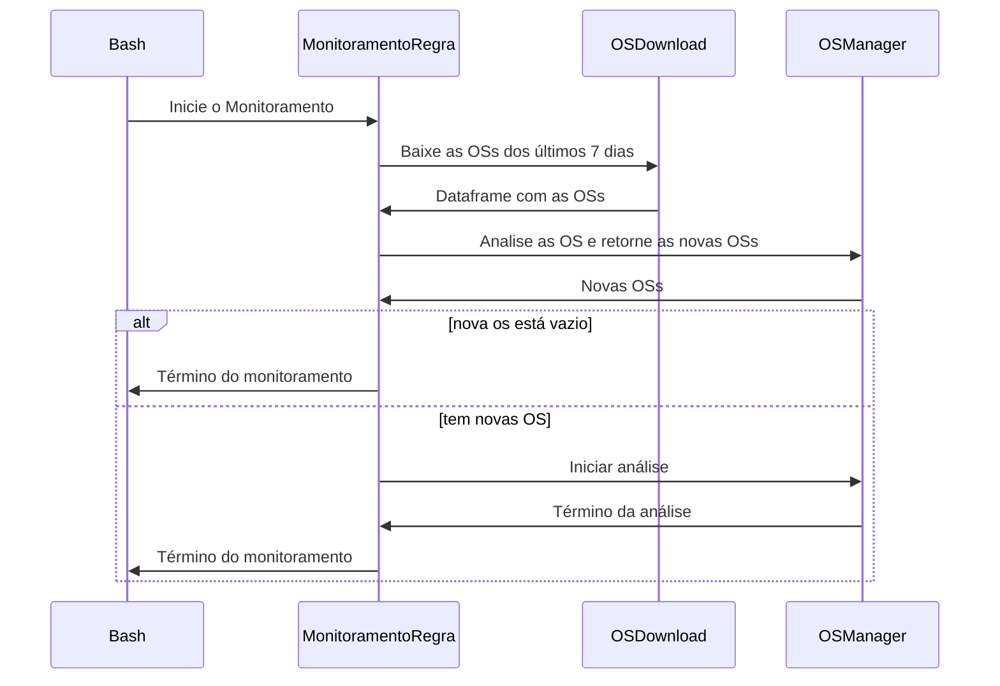
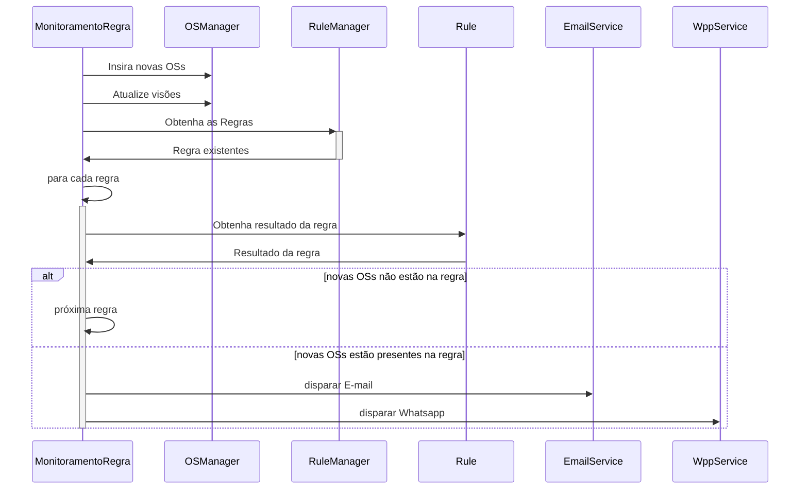

# Monitoramento de Regra

Esta pasta contém um programa Python que monitora regras de retrabalho de Ordens de Serviços (OSs). Por exemplo, uma regra pode detectar a abertura de novas OSs de Motor Esquentando de veículos que estiveram na oficina nos últimos 10 dias. Neste caso, a nova OS indica que os serviços anteriores geraram retrabalho, uma vez que não corrigiram o problema definitivamente.

O programa foi escrito na linguagem Python e requer acesso a:
* API da Empresa para consulta das OSs; e
* Banco de Dados (PostgreSQL) do sistema com as regras de monitoramento.

# Arquivos

O programa contém os seguintes arquivos:
|Arquivo|Função|
|--|--|
|`crud_email.py`|Classe que possibilita enviar alertas via e-mail|
|`crup_wpp.py`|Classe que possibilita enviar alertas via WhatsApp|
|`monitoramento_job.sh`|Bash para executar o script principal  via terminal|
|`monitoramento_regra.py`|Script principal (main) que baixa e analisa as novas OSs|
|`os_download.py`|Classe que reúne funções de download de OSs|
|`os_manager.py`|Classe que reúne funções para o pré-processamento e gestão das OSs|
|`rule_manager.py`|Classe para acessar as regras existentes|
|`rule.py`|Classe que representa uma regra de monitoramento|

Além disso, há os seguintes arquivos adicionais:
|Arquivo|Função|
|--|--|
|`Dockerfile`|Arquivo com a Imagem do Docker|
|`docker-compose.yml`|Arquivo de Instrução do Docker|
|`environment.yml`| Arquivo YML com as dependência do Conda|
|`env.sample`| Arquivo com as variáveis ambientes utilizadas, detalhadas a seguir|
|`README.md`| Este arquivo de instrução|
|`requirements.txt`| Arquivo com as dependências Python do projeto|

# Variáveis de ambiente

Além dos scripts, o programa espera receber um arquivo `.env` com as variáveis ambientes estruturadas conforme `.env.sample`. 

As variáveis são:

|Variável|Função|Exemplo|
|--|--|--|
|DB_HOST|Endereço do banco de dados PostgreSQL|127,0.0.1|
|DB_PORT|Porta do banco de dados PostgreSQL|5432|
|DB_USER|Usuário do banco de dados PostgreSQL|admin|
|DB_PASS|Senha do banco de dados PostgreSQL|senha|
|DB_NAME|Nome do banco de dados PostreSQL|nome_banco|
|RA_API_URL|Endereço HTTP da API da Rápido Araguaia|https://exemplo.ra.com/api
|RA_API_KEY|Token para acesar a API|Bearer XYZ
|SMTP|Código SMTP do Gmail para envio das mensagens|aaaa bbbb cccc dddd eeee|
|WP_ZAPI_URL|URL da API do WhatsApp no ZAPI|https://api.z-api.io/instances/xyz/token/abc|
|WP_ZAPI_TOKEN|Chave da conta|XYZABC|
|WP_ZAPI_LINK_IMAGE_URL|Imagem para usar como preview das mensagens WhatsApp|https://ceia.ufg.br/imagem.png|
|DASHBOARD_URL|Endereço do dashboard para linkar nos alertas|https://endereco.com

# Execução

O script pode ser executado diretamente no seu ambiente ou via um container (como Docker)

## Execução local

1. Copie o arquivo de variáveis de ambiente

`cp .env.sample .env`

Edite as variáveis conforme a sua configuração.

2. Crie o ambiente virtual
Você pode criar utilizando o virtualenv ou anaconda, no exemplo abaixo utilizaremos o anaconda.

`conda create -y -n analise-combustivel python=3.11`

3. Ative o ambiente

`conda activate analise-combustivel`

4. Instale as dependências 

`pip install -r requirements.txt`

5. Executar o script principal (um dia específico)

`python scripts_python/monitoramento_regra/monitoramento_regra.py`

6. Execute em lote
`bash scripts_python/monitoramento_regra/monitoramento_job.sh`

## Execução em container
TODO

# Fluxo de Execução

O fluxo de execução pode ser dividido em duas partes, a parte referente ao controle da análise (scripts e main) e o cálculo em si (subprocesso). 
Para facilitar a compreensão, o diagrama abaixo ilustra a execução do controle principal da análise. Para cada dia definido pelo script `analise_job.bash`, inicia-se o programa `analise_combustivel_main.py`, que por sua vez inicia um subprocesso por veículo.

LOOP
dfsda
fsd
f
sa

dfsd

