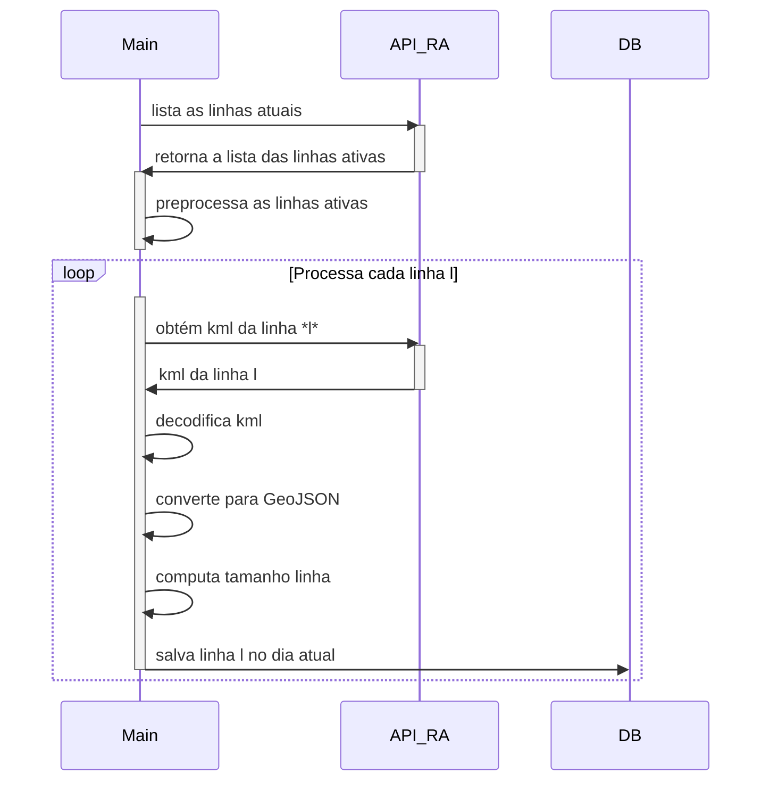

# Atualização das Linhas de Ônibus (Rápido Araguaia)

Esta pasta contém um programa Python que atualiza o percurso das linhas de ônibus. Para isso, o script acessa o banco de dados da Rápido Araguaia para receber a listagem das rotas disponíveis. Em seguida, para cada rota, baixa o arquivo KML e insere no banco de dados.

O prefixo RA indica que a fonte primária para a posição dos veículos origina-se do site da Rápido Araguaia (Olho no Trânsito). 

# Arquivos

O programa contém os seguintes arquivos:
| Arquivo                              | Função                                                                             | Parâmetros |
| ------------------------------------ | ---------------------------------------------------------------------------------- | ---------- |
| `cron.txt`                           | Exemplo para inserção do script no cron                                            | Nenhum     |
| `Dockerfile`                         | Arquivo para construção da Imagem do Docker                                        | Nenhum     |
| `ra_update_linhas_kml.py`            | Script Python que faz o update das linhas o downloa a análise                      | Nenhum     |
| `ra_update_linhas_kml.sh`            | Bash script para facilitar a execução do script e sua implantação no CRON e Docker | Nenhum     |
| `env.sample`                         | Arquivo com as variáveis ambientes utilizadas, detalhadas a seguir                 | Nenhum     |
| `README.md`                          | Este arquivo de instrução                                                          | Nenhum     |
| `requirements.txt`                   | Arquivo com as dependências Python do projeto                                      | Nenhum     |
| `start_cron_ra_update_linhas_kml.sh` | Arquivo com o script de execução do projeto via Docker                             | Nenhum     |

# Variáveis de ambiente

Além dos scripts, o programa espera receber um arquivo .env com as variáveis ambientes estruturadas conforme .env.sample. As variáveis são:

| Variável                                      | Função                                               | Exemplo                      |
| --------------------------------------------- | ---------------------------------------------------- | ---------------------------- |
| DB_HOST                                       | Endereço do banco de dados PostgreSQL                | 127.0.0.1                    |
| DB_PORT                                       | Porta do banco de dados PostgreSQL                   | 5432                         |
| DB_USER                                       | Usuário do banco de dados PostgreSQL                 | admin                        |
| DB_PASS                                       | Senha do banco de dados PostgreSQL                   | senha                        |
| DB_NAME                                       | Nome do banco de dados PostreSQL                     | nome_banco                   |
| RA_API_URL                                    | URL base da API da Rápido Araguaia                   | https://exemplo.com/api      |
| RA_API_KEY                                    | KEY da API da Rápido Araguaia                        | Bearer XYZ                   |
| RA_API_KML_URL                                | URL base da API de linhas (KML) da Rápido Araguaia   | https://exemplo2.com/kml/api |
| RA_API_KML_KEY                                | KEY da API da API de linhas (KML) da Rápido Araguaia | Bearer XYZ                   |
| CONTAINER_EXEC_NO_INICIO_RA_UPDATE_LINHAS_KML | Se o script deve ser executado ao subir o Docker     | True                         |
| CONTAINER_CRON_RA_UPDATE_LINHAS_KML           | Periodicidade de execução do script no CRON          | 0 3 * * 5                    |

# Execução

O script pode ser executado diretamente no seu ambiente ou via um container (como Docker).

## Execução local

1. Copie o arquivo de variáveis de ambiente
`cp .env.sample .env`
Edite as variáveis conforme a sua configuração.

2. Crie o ambiente virtual
Você pode criar utilizando o virtualenv ou anaconda, no exemplo abaixo utilizaremos o anaconda.
´conda create -y -n ra-update-linhas python=3.11`

3. Ative o ambiente
`conda activate ra-update-linhas`

4. Instale as dependências 
`pip install -r requirements.txt`

5. Executar o script principal 
`python ra_update_linhas_kml.py`

6. Execute em lote (ou via CRON)
`bash ra_update_linhas_kml.sh`

## Execução via Container

1. Na pasta scripts-ra, copie o arquivo de variáveis de ambiente
`cp .env.sample .env`
Edite as variáveis de ambiente conforme a sua configuração

2. Faça o build via docker
`docker compose build ra_update_linhas_kml`

3. Execute
`docker compose up ra_update_linhas_kml`

# Fluxo de Execução do Script

A figura abaixo a execução do script `ra_update_linhas_kml.py`.

